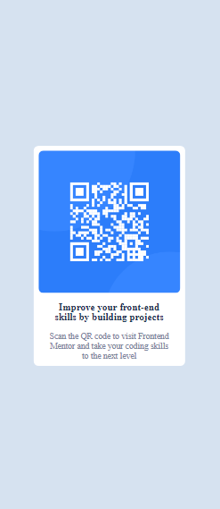

# Frontend Mentor - QR code component solution

https://www.frontendmentor.io/solutions/qr-code-component-with-css-flexbox-IRz8A_yMjF

## Table of contents

- [Overview](#overview)
  - [Screenshot](#screenshot)
  - [Links](#links)
- [My process](#my-process)
  - [Built with](#built-with)
  - [What I learned](#what-i-learned)
  - [Continued development](#continued-development)
  - [Useful resources](#useful-resources)
- [Author](#author)
- [Acknowledgments](#acknowledgments)

**Note: Delete this note and update the table of contents based on what sections you keep.**

## Overview

### Screenshot

- Desktop

- Mobile

### Links

- Solution URL: https://github.com/satryandi/FrontendMentor_QrCodeComponent/tree/main
- Live Site URL: https://satryandi-miniproject4.netlify.app/

## My process

### Built with

- Mobile-first workflow
- CSS custom properties
- Flexbox
- 

### What I learned

QR Code

### Continued development

Learning, Understanding, and Mastering HTML and CSS

### Useful resources

- W33Schools : https://www.w3schools.com/
  - This is a very good article that helped me understand the fundamentals of HTML, CSS, and JavaScript. I would recommend it to anyone who is still learning these concepts.

## Author

- Instagram : https://www.instagram.com/satryandi/
- LinkedIn : https://www.linkedin.com/in/muhammad-satryandi-ogansyah-261043264/
- Github : https://github.com/satryandi
- Frontend Mentor : https://www.frontendmentor.io/profile/satryandi

## Acknowledgments

I am very grateful to the youtube content creators about this challenge 
